# AEM Forms Performance Bot - Architecture

## System Architecture Overview

### Detailed System Architecture (Top-to-Bottom Flow)


### Detailed Component Architecture

```mermaid
graph TB
    subgraph External["🌐 EXTERNAL SYSTEMS"]
        GitHub["GitHub Platform<br/>• Pull Requests<br/>• Actions Runner<br/>• API"]
        Forms["AEM Forms<br/>• Before URL<br/>• After URL"]
        Repo["Git Repository<br/>• Source Code<br/>• functions.js<br/>• CSS files"]
    end
    
    subgraph Core["⚙️ PERFORMANCE BOT CORE"]
        Orchestrator["Main Orchestrator<br/>index.js<br/><br/>• Coordinates all phases<br/>• Manages parallel execution<br/>• Handles errors"]
    end
    
    subgraph Extract["📥 PHASE 1: DATA EXTRACTION"]
        URLAnalyzer["URL Analyzer<br/><br/>• Puppeteer headless browser<br/>• Renders client-side forms<br/>• Measures load time"]
        JSONExtractor["JSON Extractor<br/><br/>• Parses form definition<br/>• Extracts from <pre> tags"]
        HTMLParser["HTML Parser<br/><br/>• Analyzes rendered DOM<br/>• Checks structure"]
    end
    
    subgraph Analyze["🔍 PHASE 2: STATIC ANALYSIS (Parallel)"]
        CSSAnalyzer["CSS Analyzer<br/><br/>• background-image<br/>• @import statements<br/>• Selector complexity"]
        JSAnalyzer["JS Function Analyzer<br/><br/>• HTTP calls (request/fetch)<br/>• DOM access<br/>• AST parsing"]
        EventAnalyzer["Form Events Analyzer<br/><br/>• initialize events<br/>• API calls blocking render"]
        FieldAnalyzer["Hidden Fields Analyzer<br/><br/>• Unused visibility logic<br/>• Dead code detection"]
    end
    
    subgraph Runtime["⚡ PHASE 3: RUNTIME ANALYSIS"]
        RuleEngine["Rule Performance Analyzer<br/><br/>• af-core integration<br/>• Cycle detection (DFS)<br/>• Slow rules profiling<br/>• dataRef validation"]
        HTMLPerf["HTML Performance<br/><br/>• Lazy loading check<br/>• Blocking scripts<br/>• DOM size analysis"]
    end
    
    subgraph AI["🤖 PHASE 4: AI AUTO-FIX ENGINE"]
        Detector["Issue Detector<br/><br/>• Prioritizes critical issues<br/>• Groups by severity"]
        ContextBuilder["Context Builder<br/><br/>• Extracts function code<br/>• Finds call sites<br/>• Gathers dependencies"]
        AIGenerator["AI Generator<br/><br/>• Azure OpenAI GPT-5.1<br/>• Context-aware prompts<br/>• Parallel generation"]
        Validator["Code Validator<br/><br/>• 5+ safety rules<br/>• Signature preservation<br/>• Logic verification"]
        GitOps["Git Operations<br/><br/>• Auto-commit safe fixes<br/>• Create PR suggestions<br/>• Stage files"]
    end
    
    subgraph Output["📤 PHASE 5: REPORTING"]
        PRComment["PR Comment<br/><br/>• Critical issues<br/>• Metrics dashboard<br/>• Auto-fix summary"]
        HTMLReport["HTML Report<br/><br/>• Detailed analysis<br/>• GitHub Gist<br/>• Inline viewing"]
        Checks["GitHub Checks<br/><br/>• Code annotations<br/>• All issues visible<br/>• Action required status"]
        Suggestions["PR Suggestions<br/><br/>• Line-level comments<br/>• One-click apply"]
    end
    
    %% Main flow
    GitHub -->|Triggers| Orchestrator
    Forms --> URLAnalyzer
    Repo --> JSAnalyzer
    
    Orchestrator --> URLAnalyzer
    URLAnalyzer --> JSONExtractor
    URLAnalyzer --> HTMLParser
    
    Orchestrator --> CSSAnalyzer & JSAnalyzer & EventAnalyzer & FieldAnalyzer
    
    JSONExtractor --> RuleEngine
    HTMLParser --> HTMLPerf
    
    CSSAnalyzer & JSAnalyzer & EventAnalyzer & FieldAnalyzer & RuleEngine & HTMLPerf --> Detector
    
    Detector --> ContextBuilder --> AIGenerator --> Validator --> GitOps
    
    GitOps --> PRComment & HTMLReport & Checks & Suggestions
    
    PRComment & HTMLReport & Checks & Suggestions --> GitHub
    GitOps --> Repo
    
    %% Styling
    classDef external fill:#f0f0f0,stroke:#666,stroke-width:2px
    classDef core fill:#e1f5ff,stroke:#0078d4,stroke-width:3px
    classDef extract fill:#fff4ce,stroke:#ffa500,stroke-width:2px
    classDef analyze fill:#fef9e7,stroke:#f39c12,stroke-width:2px
    classDef runtime fill:#e8daef,stroke:#8e44ad,stroke-width:2px
    classDef ai fill:#ffe6f0,stroke:#d13438,stroke-width:2px
    classDef output fill:#e6ffe6,stroke:#107c10,stroke-width:2px
    
    class GitHub,Forms,Repo external
    class Orchestrator core
    class URLAnalyzer,JSONExtractor,HTMLParser extract
    class CSSAnalyzer,JSAnalyzer,EventAnalyzer,FieldAnalyzer analyze
    class RuleEngine,HTMLPerf runtime
    class Detector,ContextBuilder,AIGenerator,Validator,GitOps ai
    class PRComment,HTMLReport,Checks,Suggestions output
```



## Component Details

### 1. Data Extraction Layer
- **URL Analyzer**: Headless browser (Puppeteer) renders client-side forms
- **JSON Extractor**: Parses form definition from HTML `<pre>` tags
- **HTML Parser**: Analyzes rendered DOM structure

### 2. Static Analysis Layer (Parallel Execution)
| Analyzer | Detects | Critical Issues |
|----------|---------|-----------------|
| **CSS** | background-image, @import, selectors | Render blocking, lazy loading |
| **JS Functions** | HTTP calls, DOM access | Architectural violations |
| **Form Events** | API calls in initialize | Blocks rendering |
| **Hidden Fields** | Unused visibility logic | Dead code |

### 3. Runtime Analysis Layer
- **Rule Performance**: Uses `@aemforms/af-core` to detect cycles, slow rules, dataRef errors
- **HTML Performance**: Analyzes lazy loading, blocking scripts, DOM size

### 4. AI Auto-Fix Engine
```
Issue Detection → Context Building → AI Generation → Validation → Auto-Apply
     ↓                   ↓                  ↓             ↓           ↓
  Prioritize      AST + Call Sites    GPT-5.1-Codex   Safety    Git Commit
  Critical        + File Context      + Prompts       Checks    + PR Review
```

**AI Fix Types:**
- **Auto-Commit**: CSS imports, background-image, runtime errors
- **PR Suggestions**: HTTP calls, DOM access (architectural changes)
- **Annotations**: All issues visible in GitHub Checks tab

### 5. Reporting Layer
- **PR Comment**: Concise markdown with critical issues + metrics
- **HTML Report**: Comprehensive report hosted on GitHub Gist (inline viewing)
- **GitHub Checks**: Annotations on code files with fix suggestions
- **Line-Level Suggestions**: One-click apply for simple fixes

## Key Technologies

| Layer | Technology | Purpose |
|-------|-----------|---------|
| **Orchestration** | Node.js, GitHub Actions | Execution environment |
| **Browser** | Puppeteer | Client-side rendering |
| **Parsing** | Acorn, Cheerio | AST + HTML analysis |
| **AI** | Azure OpenAI GPT-5.1-Codex | Code generation |
| **Forms** | @aemforms/af-core | Rule engine analysis |
| **Git** | Simple-git | Auto-commit fixes |
| **Reporting** | GitHub API, Octokit | Comments, Checks, Gists |

## Data Flow


## Performance Optimization

1. **Parallel Execution**: All analyzers run concurrently
2. **Lazy Loading**: Only load files when needed
3. **Caching**: Form instances cached across analyses
4. **AI Batching**: Multiple fixes generated in parallel
5. **Incremental**: Only analyze changed forms

## Security & Safety

1. **Sandboxed Execution**: GitHub Actions isolation
2. **Code Validation**: 5+ rules before auto-applying
3. **AI Safety Checks**: Signature preservation, logic preservation
4. **Review Required**: Architectural changes are comment-only
5. **Rollback**: Bot commits clearly marked, easy to revert

## Metrics & Impact

| Metric | Target | Actual |
|--------|--------|--------|
| **Issues Detected** | 10+ types | 15 types |
| **Auto-Fix Rate** | 60% | 70% |
| **False Positives** | <5% | ~2% |
| **Execution Time** | <5 min | ~3 min |
| **Developer Time Saved** | 2-4 hrs/PR | ~3 hrs/PR |

## Future Enhancements

- Multi-form comparison reports
- Historical trend analysis
- Custom rule engine integration
- Visual Rule Editor integration
- Real-time form monitoring

